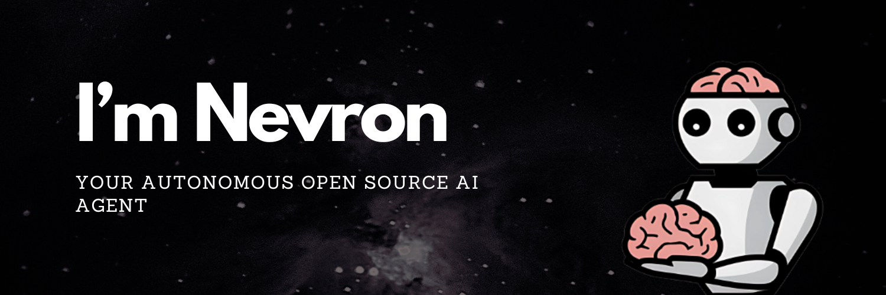

# Nevron - Lightweight AI Agent Framework

## About

Nevron is the core framework developed powering the intelligence inside [Neurodex](https://neurodex.ai), enabling you to build flexible autonomous AI agents effortlessly.

**Set up your agent in 2 minutes, run in 5, and deploy in 10.**

## Documentation

For further details, please refer to our [official documentation](https://axioma-ai-labs.github.io/nevron/).

## License

This project is licensed under the Nevron Public License (NPL). See the [LICENSE](LICENSE) file for details.

---

Made with ❤️ by [Neurobro](https://neurobro.ai)
