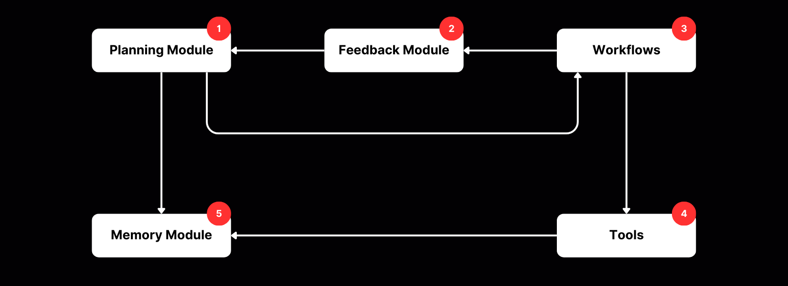

# **Nevron Overview**

## Architecture

Nevron is an autonomous AI agent built with a modular architecture consisting of several key components that work together to enable intelligent decision-making and task execution.

### Decoupled Runtime Architecture

Nevron uses a decoupled architecture where the **Agent**, **API**, and **Dashboard** run as independent processes:

```
┌─────────────────┐     ┌──────────────────┐     ┌─────────────────┐
│   Dashboard     │────▶│   FastAPI        │────▶│  Shared State   │
│   (Svelte)      │     │   (Port 8000)    │     │  ./nevron_state │
│   Port 5173     │◀────│   + WebSocket    │◀────│                 │
└─────────────────┘     └──────────────────┘     └────────┬────────┘
                                                          │
                              nevron_config.json ─────────┤
                                                          │
                                                          ▼
                                                 ┌─────────────────┐
                                                 │  Agent Runner   │
                                                 │  (Independent)  │
                                                 └─────────────────┘
```

**Key Benefits:**
- Control the agent lifecycle (start/pause/resume/stop) from the dashboard
- Configure everything via UI - no `.env` file needed for basic setup
- Restart API without stopping the agent
- Multiple dashboards can connect simultaneously
- Agent continues running if dashboard disconnects

### Agent Lifecycle

The agent starts in **stopped** state and waits for commands:

1. **Stopped** - Agent process running but not executing cycles (initial state)
2. **Running** - Agent actively executing decision-making cycles
3. **Paused** - Cycles paused, ready to resume immediately
4. **Error** - Agent stopped due to an error

Control the lifecycle through the Dashboard's Control page or via API endpoints.

### Component Architecture




### 1. Planning Module (LLM-based Decision Making)
The Planning Module serves as the decision-making engine, leveraging the power of Large Language Models (LLMs) to make intelligent decisions based on context. It determines the next optimal action by analyzing the current system state, the agent's goals and personality, and the outcomes of previous actions. This iterative process allows the agent to adapt and respond to changing conditions while maintaining coherent behavior aligned with its defined purpose.

### 2. Feedback Module
The Feedback Module bridges planning and execution by processing the outcomes of system actions. It uses an LLM call to evaluate action outcomes and saves these evaluations to the context, directly influencing the next decision in the Planning Module. This creates a continuous learning loop where each action's outcome informs future decisions.

### 3. Workflows
Workflows act as the execution layer, translating high-level plans into actionable steps. This module manages task sequences and dependencies. It provides standardized operation patterns, maintaining consistency and efficiency throughout the system.

Using workflows, Nevron can perform tasks such as **signal analysis** or **news research**.

### 4. Tools
The Tools module represents the operational toolkit, executing workflow tasks via integrations. It interfaces seamlessly with external services and APIs to deliver concrete implementation capabilities. 

This enables effective real-world interactions such as sending messages to **Telegram** or **Twitter**.

### 5. Memory Module (Vector Storage)
The Memory Module, powered by vector databases like [ChromaDB](https://www.trychroma.com/) or [Qdrant](https://qdrant.tech/), serves as a sophisticated storage system for the platform. 

It maintains a persistent history of actions, outcomes, and context, facilitating efficient retrieval of relevant information for decision-making. By storing this contextual information as vector embeddings, it enables semantic search capabilities that help the agent make more informed decisions based on similar past experiences.

-----

## Decision Making Process

1. **Context Assessment**
      - Nevron evaluates current context
      - Retrieves relevant memories
      - Considers agent personality and goals
      - Analyzes available actions and previous outcomes

2. **LLM-based Action Selection**
      - LLM selects optimal action based on context
      - Agent personality influences decision style
      - Agent goals guide decision priorities
      - Previous action outcomes inform current choices

3. **Execution**
      - Selected workflow is triggered
      - Tools are utilized as needed
      - Results are captured

4. **Feedback Loop**
      - Action outcomes are evaluated by LLM
      - Evaluation is saved to context
      - This updated context influences the next decision
      - Process repeats after configured rest time

## Iterative Process

Nevron operates in an iterative cycle:

1. Make a decision based on current context
2. Execute the selected action
3. Evaluate the outcome
4. Update the context with the outcome and evaluation
5. Wait for the configured rest time
6. Repeat the process with the updated context

The time between actions is defined in the configuration (`AGENT_REST_TIME`), allowing you to control how frequently the agent takes actions.

## Configuration

The agent's behavior can be configured in two ways:

### Dashboard Configuration (Recommended)

Open http://localhost:5173 and navigate to **Settings** to configure:

- **LLM Provider**: Choose from OpenAI, Anthropic, xAI, DeepSeek, Qwen, Venice
- **API Key**: Enter and validate your provider's API key
- **Model**: Select the model to use
- **Agent Personality**: Defines the agent's communication style and decision-making approach
- **Agent Goals**: Establishes the agent's primary objectives and workflow patterns
- **Actions**: Enable/disable available actions
- **Integrations**: Configure Twitter, Discord, Telegram, etc.
- **MCP Servers**: Add custom tool servers

Configuration is saved to `nevron_config.json`.

### Environment Variables

For Docker or headless deployments, use environment variables:

- **Agent Personality**: `AGENT_PERSONALITY`
- **Agent Goals**: `AGENT_GOAL`
- **Rest Time**: `AGENT_REST_TIME` - Controls the frequency of agent actions
- **LLM Settings**: Provider-specific API keys and models
- **Workflows**: Defines available task execution patterns
- **Tools**: Determines the agent's capabilities for interacting with external systems

See [Configuration](../configuration.md) for complete details.

-----

If you have any questions or need further assistance, please refer to the [GitHub Discussions](https://github.com/axioma-ai-labs/nevron/discussions).
