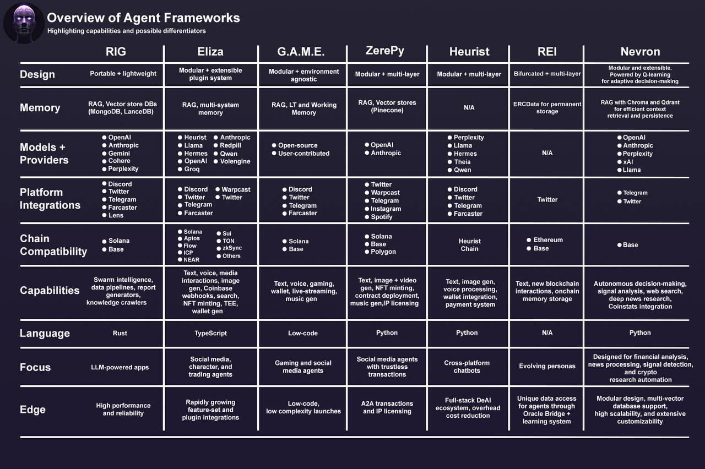

# **Developer Documentation**

Learn how to build your first Nevron, an autonomous AI agent in Python.

This framework is designed to be a modular and extensible framework for building autonomous AI agents, which can perform tasks independently on their own.

Follow this documentation to learn how to create your first Nevron, build your own tools & workflows, and integrate with external services.

> **Documentation Versions**
> 
> - **stable**: Latest stable release (from the main branch)
> - **dev**: Development version (from the dev branch)
> 
> You can switch between versions using the version selector in the top navigation bar.

## Overview

Nevron is an open-source framework that supports the development, deployment, and management of autonomous AI agents.

This framework is built on top of:

- [Python](https://www.python.org/) programming language
- State-of-the-art LLM-powered intelligence
- Modular architecture with planning, feedback, execution and memory components
- Integration with external services (Telegram, Twitter, Discord, etc.)
- Vector-based memory storage using [Chroma](https://www.trychroma.com/) or [Qdrant](https://qdrant.tech/)
- Local LLM support with [Ollama](https://ollama.ai)

-----

## Core Features

- **Autonomous Decision Making**: Nevron uses Q-learning algorithm for intelligent decision making
- **LLM Integration**: Powered by a wide range of Large Language Models (e.g., OpenAI, Anthropic, xAI, DeepSeek, etc.)
- **Local LLM Support**: Run models locally with Ollama integration
- **Modular Workflows**: Predefined autonomous agent task execution patterns
    - Analyze signal workflow
    - Research news workflow
- **Memory Management**: Vector storage for context retention
    - ChromaDB (default)
    - Qdrant (alternative)
- **External Integrations**: Comprehensive set of tools for various platforms and services
- **Docker Deployment**: Easy deployment with Docker Compose

-----

## Nevron vs. Other Frameworks

-----

## Core Components

### 1. Planning Module
Handles decision-making using LLM of choice with the context of previous actions and their outcomes.

### 2. Memory Module
Manages agent's memory using vector storage for efficient context retrieval, which enables the agent to remember and recall previous interactions and events.

- **Multiple Vector Databases Support**
    - [Chroma](https://www.trychroma.com/) (default)
    - [Qdrant](https://qdrant.tech/) (alternative vector database)

- **Features**
    - Vector embeddings via OpenAI's [text-embedding-3-small](https://platform.openai.com/docs/guides/embeddings/what-are-embeddings) model
    - Semantic similarity search
    - Metadata storage for context
    - Configurable collection management

- **Backend**
    - Abstract memory backend interface
    - Modular backend architecture for optimal performance & customization
    - Async storage and retrieval operations

More about memory module can be found in the [Memory](agent/memory.md) section.

### 3. Feedback Module

Feedback module is responsible for processing action results and updating the context for future decisions in Planning Module.

- **Functions**
    - Collects feedback from action execution
    - Evaluates action outcomes
    - Maintains feedback history and context

- **Integration**
    - Direct integration with Planning Module
    - Performance metrics tracking

More about feedback module can be found in the [Planning](agent/planning.md) section.

### 4. Tools & Workflows

Nevron supports integrations with external services and APIs for extended functionality & integrations in different platforms.

For development purposes, Nevron comes with a comprehensive set of tools that can be used as a starting point for building your own tools and integrating more complex functionality to your AI agent.

#### Workflows

Nevron allows you to define custom logic of different tools into reusable workflows, which the agent can use.

Nevron comes with two pre-configured workflows:

- `Analyze signal`: Processes and analyzes incoming signal data
- `Research news`: Gathers and analyzes news using Perplexity API

#### Available Tools

Nevron includes a variety of tools for different purposes:

- **X (Twitter)**
    - Post tweets
    - Media handling
    - Thread creation

- **Discord**
    - Listen to incoming messages
    - Send messages to channels

- **Telegram**
    - Send telegram messages
    - Bot integration
    - Channel/group support
    - HTML message formatting

- **WhatsApp**
    - Get messages
    - Post messages

- **Tavily**
    - Semantic search
    - Web search capabilities

- **Perplexity**
    - Advanced search functionality
    - Research capabilities

And many more tools for various platforms and services. For a complete list, refer to the [Tools](agent/tools/index.md) section.

### 5. LLM Integration

Powers the agent's intelligence and natural language capabilities.

- **Supported Providers**
    - OpenAI
      - gpt-4o for decision making
      - text-embedding-3-small for embeddings
    - Anthropic (Claude models)
    - xAI (Grok models)
    - DeepSeek
    - Qwen
    - Venice
    - Llama
      - Via API (api.llama-api.com)
      - Via OpenRouter
      - Via Fireworks
      - Locally with Ollama

More about LLM integration can be found in the [LLM](agent/llm.md) section.

### 6. Deployment Options

- **Docker Compose**
  - Complete stack deployment
  - Service orchestration
  - Volume management
  - Network isolation

- **Local Development**
  - Python 3.13 with Poetry
  - Customizable configuration
  - Easy debugging and extension

More about deployment can be found in the [Deployment](deployment.md) section.

-----

## Getting Started

For setup and development instructions, please refer to our [Quickstart](quickstart.md) and set up your first AI agent in minutes.

-----

## Creators

Nevron was created by the [Neurobro](https://neurobro.ai) team. If you want to learn more about Nevron, our core values & the team behind it, please visit the [About](about.md) page.

Support by upvoting [Nevron](https://www.producthunt.com/posts/nevron) on Product Hunt.

If you have any questions or need further assistance, please refer to the [GitHub Discussions](https://github.com/axioma-ai-labs/nevron/discussions).